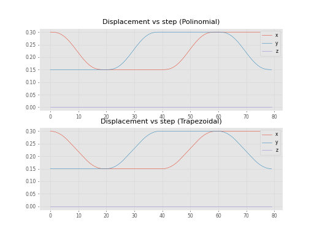
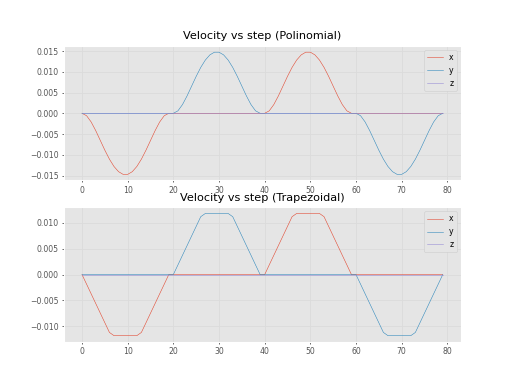
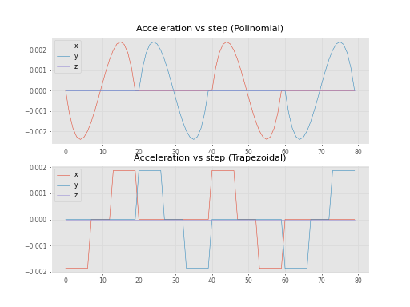
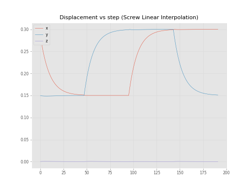
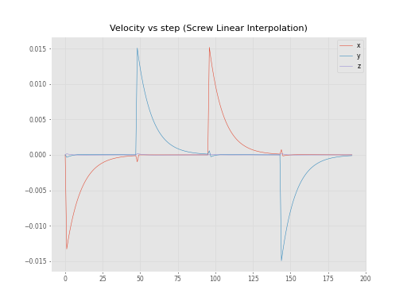
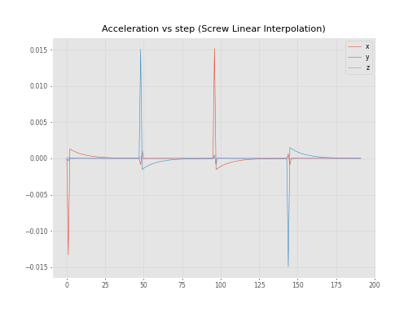

# Puma560Trajectory for a welding 6DOF manipulator

The project aims to explain and show two different path methods of moving planning to weld a square piece. We used the Puma 560 Manipulator to simulate the motion. The resulting path is shown below.

## Polynomial interpolation

## Trapezoidal interpolation

The main differences on motion curves are shown below.

## Displacement vs step (Polynomial and trapezoidal interpolation)

## Velocity vs step (Polynomial and trapezoidal interpolation)

## Acceleration vs step (Polynomial and trapezoidal interpolation)

## Displacement vs step (Screw linear interpolation)

## Velocity vs step (Screw linear interpolation)

## Acceleration vs step (Screw linear interpolation)

