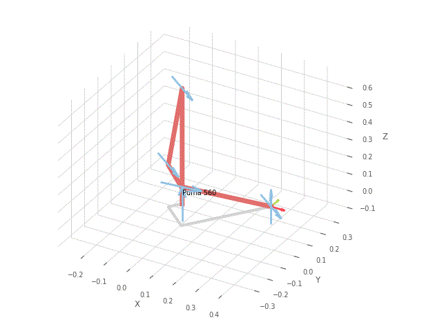

# Puma560Trajectory for a welding 6DOF manipulator

The project ais to explain and show two different path methods of moving planning to weld a square piece.
# Polynomial interpolation

# Trapezoidal interpolation

