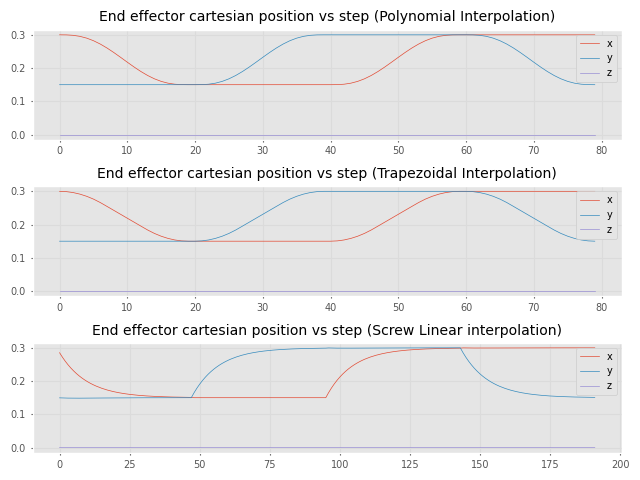
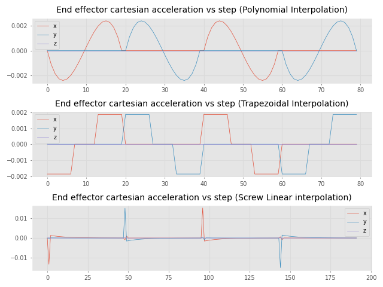

# Puma560Trajectory for a welding 6DOF manipulator

The project aims to explain and show three different interpolation methods on moving planning to weld a square piece. We used the Puma 560 Manipulator to simulate the motion. The resulting path is shown below.

## Getting started
Execute `git clone [URL]` to clone the repository, the dependencies are found on `requirements.txt` file. You can use the virtual environment you prefer. You can create your virtual environment by following the steps below.

1. Open a terminal on root of the project `<local_path>/Puma560Trajectory`.
2. Create a virtual environment with `python3 -m venv ./venv`, you will see a directory `venv`.
3. In case of error related with `python3-venv`, install it with `sudo apt-get install python3-venv`.
4. Repeat step 2 with `python3 -m venv ./venv`.
5. To activate it, execute `source ./venv/bin/activate` on root, at the left of terminal you will see `(venv)`, that means that you are using your virtual environment Python interpreter
6. To check installed dependencies, you can execute `pip list`, and you will check some default dependencies installed.
7. Finally, to deactivate your virtual environment you can execute `deactivate`.
8. To install the dependencies of the current project execute `pip install -r requirements.txt`.

You can surely find more info at [venv — Creation of virtual environments](https://docs.python.org/3/library/venv.html#module-venv)

## Trajectory animation

### Polynomial interpolation

### Trapezoidal interpolation

### Screw Linear interpolation

## Joint effector cartesian motion
The main differences on the end effector cartesian motion curves are shown below.

### Displacement vs step

### Velocity vs step

### Acceleration vs step

## Joints motion
Meanwhile the main differences on the joint motion curves are shown bellow.

### Displacement vs step

### Velocity vs step

### Acceleration vs step

