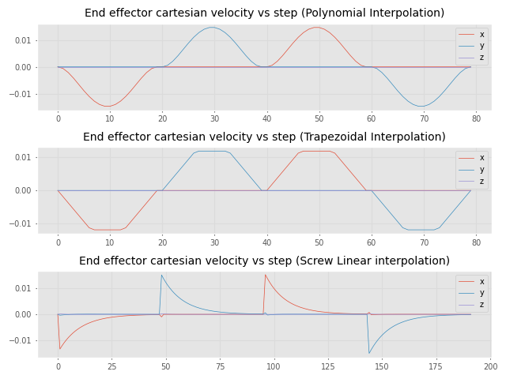

# Puma560Trajectory for a welding 6DOF manipulator

The project aims to explain and show three different interpolation methods on moving planning to weld a square piece. We used the Puma 560 Manipulator to simulate the motion. The resulting path is shown below.

## Getting started
Execute `git clone [URL]` to clone the repository, the dependencies are found on `requeriments.txt` file. You can use the virtual environment you prefer. Then execute `pip install -r requirements.txt` to install all dependencies.

## Trajectory animation

### Polynomial interpolation

### Trapezoidal interpolation

### Screw Linear interpolation

## Joint effector cartesian motion
The main differences on the end effector cartesian motion curves are shown below.

### Displacement vs step

### Velocity vs step

### Acceleration vs step

## Joints motion
Meanwhile the main differences on the joint motion curves are shown bellow.

### Displacement vs step

### Velocity vs step

### Acceleration vs step

